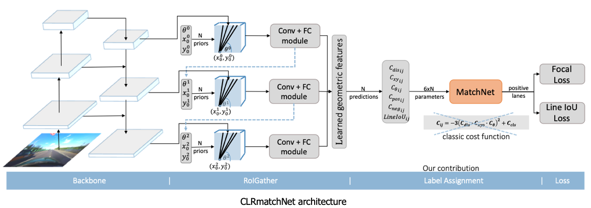
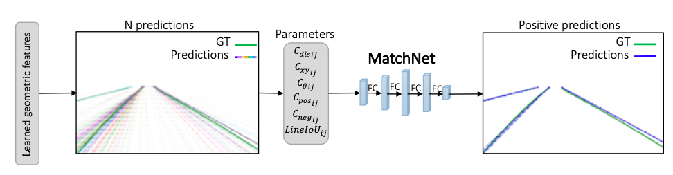
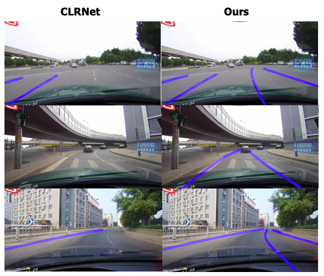

<div align="center">

# CLRmatchNet: Enhancing Curved Lane Detection with Deep Matching Process

</div>

[](https://paperswithcode.com/sota/lane-detection-on-culane?p=clrmatchnet-enhancing-curved-lane-detection)

Pytorch implementation of the paper "[CLRmatchNet: Enhancing Curved Lane Detection with Deep Matching Process.](https://arxiv.org/pdf/2309.15204v1)" 
Sapir Kontente, Roy Orfaig and Ben-Zion Bobrovsky, Tel-Aviv University

## Introduction

Our research introduces MatchNet, a deep learning sub-module-based approach aimed at enhancing the label assignment process. 
Integrated into the state-of-the-art lane detection network Cross Layer Refinement Network for Lane Detection (CLRNet),
MatchNet replaces the conventional label assignment process with a sub-module network. 
This integration results in significant improvements in scenarios involving curved lanes, with remarkable improvement across all backbones.

### CLRmatchNet Architecture



### MatchNet Architecture



## Results Examples



## Installation

### Environment Setup
Ubuntu18.04 and 20.04 with:
- Python >= 3.8 (tested with Python3.8)
- PyTorch >= 1.7 (tested with Pytorch1.7)
- CUDA (tested with cuda11)
- Other dependencies described in `requirements.txt` 

### Conda Virtual Environment

```Shell
conda create -n clrmatchnet python=3.8 -y 
conda activate clrmatchnet
```

### Install dependencies

```Shell
# Install pytorch, the cudatoolkit version should be same in your system.
conda install pytorch torchvision torchaudio cudatoolkit=11.0 -c pytorch -c nvidia

# Or you can install via pip
pip install torch==1.7.0+cu110 torchvision==0.8.1+cu110 torchaudio===0.7.0 -f https://download.pytorch.org/whl/torch_stable.html

# Install python packages
python setup.py build develop
```


### Data

Download [CULane](https://xingangpan.github.io/projects/CULane.html). Then extract them to `$CULANEROOT`. Create link to `data` directory.

```Shell
cd $CLRMATCHNET_ROOT
mkdir -p data
ln -s $CULANEROOT data/CULane
```

For CULane, you should have structure like this:
```
$CULANEROOT/driver_xx_xxframe    # data folders x6
$CULANEROOT/laneseg_label_w16    # lane segmentation labels
$CULANEROOT/list                 # data lists
```

We filtered a subset of curved lane train data for training our model, which is listed in `train.txt` and `train_gt.txt` files. When training, substitute the original downloaded files located in `$CULANEROOT/list/train.txt` and `$CULANEROOT/list/train_gt.txt` with these provided files.

## Train
We use a pretrained CLRNet model as our baseline for training. Please download [CLRNet models](https://github.com/turoad/CLRNet/releases) and extract them to 'PRETRAINED_CLRNET" 

```Shell
cd $CLRMATCHNET_ROOT
mkdir pretrained_clrnet
cd pretrained_clrnet

wget https://github.com/Turoad/CLRNet/releases/download/models/culane_r101.pth.zip
unzip culane_r101.pth.zip

wget https://github.com/Turoad/CLRNet/releases/download/models/culane_r34.pth.zip
unzip culane_r34.pth.zip

wget https://github.com/Turoad/CLRNet/releases/download/models/culane_dla34.pth.zip
unzip culane_dla34.pth.zip
```

### Training MatchNet
Please note, we utilized Resnet101 as the backbone for training MatchNet and then used it to train all three models of CLRmatchNet, which include DLA34, ResNet34, and ResNet101.

For training matchnet, run
```Shell
python main.py [configs/path_to_your_config] --gpus [gpu_num] --finetune_from [pretrained_clrnet/path_to_CLRNet_ckp] --train_matchnet
```

For example, run
```Shell
python main.py configs/clrnet/clr_resnet101_culane.py --gpus=2 --finetune_from=pretrained_clrnet/culane_resnet101.pth --train_matchnet
```

The trained model will be saved into `matchnet/ckp/epoch.pth`.

### Training CLRmatchNet
For training CLRmatchNet, use the pretrained matchnet model and run
```Shell
python main.py [configs/path_to_your_config] --gpus [gpu_num] --finetune_from [pretrained_clrnet/path_to_CLRNet_ckp] --matchnet_ckp [matchnet.pth]
```

For example, run
```Shell
python main.py configs/clrnet/clr_resnet101_culane.py --gpus=1 --finetune_from=pretrained_clrnet/culane_resnet101.pth --matchnet_ckp=releases/matchnet.pth
```


## Validation
For testing CLRmatchNet, use the pretrained CLRmatchNet model and run
```Shell
python main.py [configs/path_to_your_config] --[test|validate|demo] --load_from [path_to_clrmatchnet_model] --gpus [gpu_num]
```

For example, run
```Shell
python main.py configs/clrnet/clr_dla34_culane.py --test --load_from=culane_dla34.pth --gpus=1
```

This code can output the visualization result when testing, just add `--view`.
We will get the visualization result in `work_dirs/xxx/xxx/xxx/visualization`.

## Demo
For demo of CLRmatchNet results, run
```Shell
python main.py [configs/path_to_your_config] --demo --load_from [path_to_clrmatchnet_model] --gpus [gpu_num] --view
```

For example, run
```Shell
python main.py configs/clrnet/clr_resnet101_culane.py --demo --load_from=culane_resnet101.pth --gpus=1 --view
```

Results can be found in `work_dirs/xxx/xxx/demo/visualization`.

[assets]: https://github.com/sapirkontente/CLRmatchNet/releases/tag/models

## Results

|   Backbone  |  mF1 | F1@50  | F1@75 | Curve - F1@50 |
| :---  |  :---:   |   :---:    | :---:|  :---:|
| [ResNet-34][assets]     | 55.22  |  79.60   | 62.10 | 75.57 |
| [ResNet-101][assets]     | 55.69| 80.00   | 63.07 | 77.87 |
| [DLA-34][assets]     | 55.14|  79.97   | 62.10 | 77.09  |

“F1@50” refers to the official metric, i.e., F1 score when IoU threshold is 0.5 between the gt and prediction. "F1@75" is the F1 score when IoU threshold is 0.75.

## Citation

If our paper and code are beneficial to your work, please consider citing:
```
@article{CLRmatchNet,
  title={CLRmatchNet: Enhancing Curved Lane Detection with Deep Matching Process},
  author={S. Kontente, R. Orfaig and B. Bobrovsky},
  journal={arXiv preprint arXiv:2309.15204},
  year={2023}
}
```

## Acknowledgement
<!--ts-->
* [Turoad/CLRNet](https://github.com/Turoad/CLRNet)
* [open-mmlab/mmdetection](https://github.com/open-mmlab/mmdetection)
* [pytorch/vision](https://github.com/pytorch/vision)
* [Turoad/lanedet](https://github.com/Turoad/lanedet)
* [ZJULearning/resa](https://github.com/ZJULearning/resa)
* [cfzd/Ultra-Fast-Lane-Detection](https://github.com/cfzd/Ultra-Fast-Lane-Detection)
* [lucastabelini/LaneATT](https://github.com/lucastabelini/LaneATT)
* [aliyun/conditional-lane-detection](https://github.com/aliyun/conditional-lane-detection)
<!--te-->
